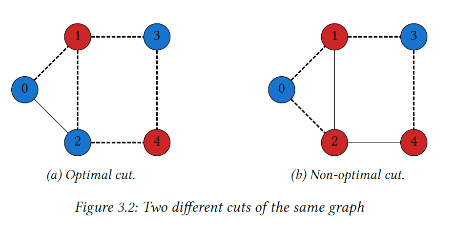
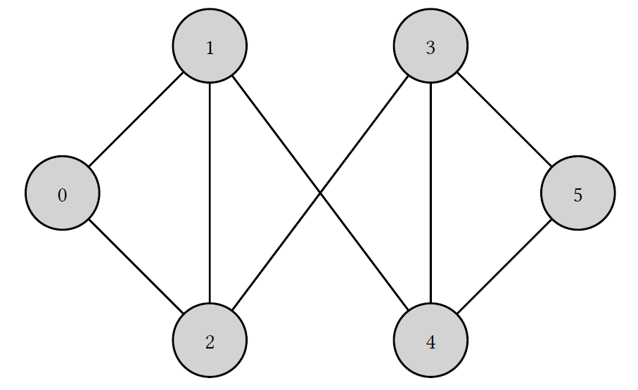

# Quadratic unconstrained Binary Optimization Problems

## The Max-Cut problem and the Ising model
That is, it is a partition of the graph's vertices into two complementary sets S and T, such that the number of edges between S and T is as large as possible. Finding such a cut is known as the max-cut problem.

### Problem formulation

We can formulate the above graph as the follwoing:

$$
\begin{array}{ll}
    \text{Minimize} & z_{0}z_{1}+z_{0}z_{2}+z_{1}z_{0}+z_{1}z_{2}+z_{1}z_{4}+z_{2}z_{0}+z_{2}z_{1}+z_{2}z_{3}\\
     & +z_{3}z_{4}+z_{3}z_{5}+z_{4}z_{5}\\
    \text{subject to} & z_{j} \in {-1,1}, j = 0, \cdots,4.
\end{array}
$$

### The Ising model

As you can easily check that if $J_{jk}$ coefficients are $-1$ and all the $h_j$ coefficients are $0$, the problem is exactly the same as the max-cut problem.

## Formulating optimization problems the quantum way

## Miving from Ising to QUBO and back
Let's say taht you are given a set of integers $S$ and $T$, and you are asked whether there is any subset of $S$ whose sum is $T$. For example, if $S = \{1,3,4,7,-4\}$ and $T = 6$, then the answer is affirmative because $3+7-4 = 6$. If $S = \{2,-2,4,8,-12 \}$ and $T=1$, the answer is **negative** because all the numbers in the set are even and they cannot add up to an odd number.

This problem is so called the **Subset Sum** problem and known for a $N$**-complete**. It turns out that we can **reduce** the Subset Sum problem to finding a spin configuration of minimal energy for any Ising model.

Let's consider a binery values instead of $1$ and $-1$ in this case. if we are given a case $S = {a_{0},\cdots,a_{m}}$ and an integer $T$, we can define binary variable $x_j, j=0,\cdots,m$ and consider

$$
c(x_{0},x_{1},\cdots,x_{m}) = (a_{0}x_{0}+a_{1}x_{1}+ \cdots +a_{m}x_{m} - T)^{2}
$$

and we can find the positive answer if and only if we can find the binary values $x_j, j=0,\cdots, m$ such that $c(x_{0},x_{1}, \cdots, x_{m}) = 0$.

For example, if we are given a set of $S = \{1,4,-2 \}$ and $T=2$, we can formulate the question as:

$$
\begin{array}{ll}
\text{minimize} & (x_{0}+4x_{1}-2x_{2}-2)^{2}\\
\text{subject to} & x_{j}\in \{0,1\}, \ j = 0, \cdots,m
\end{array}
$$

and we have to expand $(x_{0}+4x_{1}-2x_{2}-2)^{2}$ to obtain the epxression to be optimized. For this case, we need $x_{0}, x_{1} = x_{2} = 1$ to find a optimal solution.

Notice that, in all of these cases, the function $c(x_{0},x_{1},\cdots,x_{m})$ that we need to minimize is a polynomial of degree $2$ on the binary variables $x_j$. We thus generalize this setting and define {==**Quadratic Unconstrained Binary Optimization (QUBO)**==} problems.

$$
\begin{array}{lll}
\text{minimize} & q(x_{0},\cdots,x_{m})\\
\text{subject to} & x_{j}\in \{0,1\}, \ j = 0, \cdots,m
\end{array}
$$

where $q(x_{0},\cdots,x_{m})$ is a quadratic polynomial on the $x_j$ variables.

!!! note 
    We are calling this QUBO since we are minimizing quadratic expressions over binary variables with no restrictions (every combinations of ones and zeros are acceptable).

For an Ising problem, if you want to minimize:

$$
-\sum_{j,k}J_{j,k}z_{j}z_{k} - \sum_{j} h_{j}z_{j}
$$

with some variables $z_{j}$, $j = 0,\cdots,m$, taking values $1$ or $-1$, you can define new variables $x_{j} = (1-z_{j})/2$. $x_{j}$ will be $0$ when $z_{j}$ is $1$, and $1$ when $z_{j}$ is $-1$.

On the other hand, you can define a new variable called $z_{j} = 1-2x_{j}$, which leads you to a quadratic polynomial in the binary variable $x_j$ that takes exactly the same values as the energy function of the original Ising model. If you minimize the polynomical for the variables $x_{j}$, you can then recover the spin value $z_{j}$ that achieve the minimal energy. As you may wonder, you can also use $z_{j} = 2x_{j}-1$ to transform Ising problem into QUBO.

For example, if the Icing energy is given by $\frac{1}{2}z_{0}z_{1}+z_{2}$, then, under the transformation $z_{j} = 1-2x_{j}$, the corresponding QUBO problem will be (by substitute $z_{0} = 1-2x_{0}$, $z_{1} = 1-2x_{1}$, and $z_{2} = 1-2x_{2}$ in to Ising energy $\frac{1}{2}z_{0}z_{1}+z_{2}$.):

$$
\begin{array}{lll}
\text{minimize} & -2x_{0}x_{1}+x_{0}+x_{1}-2x_{2}+\frac{1}{2}\\
\text{subject to} & x_{j}\in \{0,1\}, \ j =0, 1, 2.
\end{array}
$$

